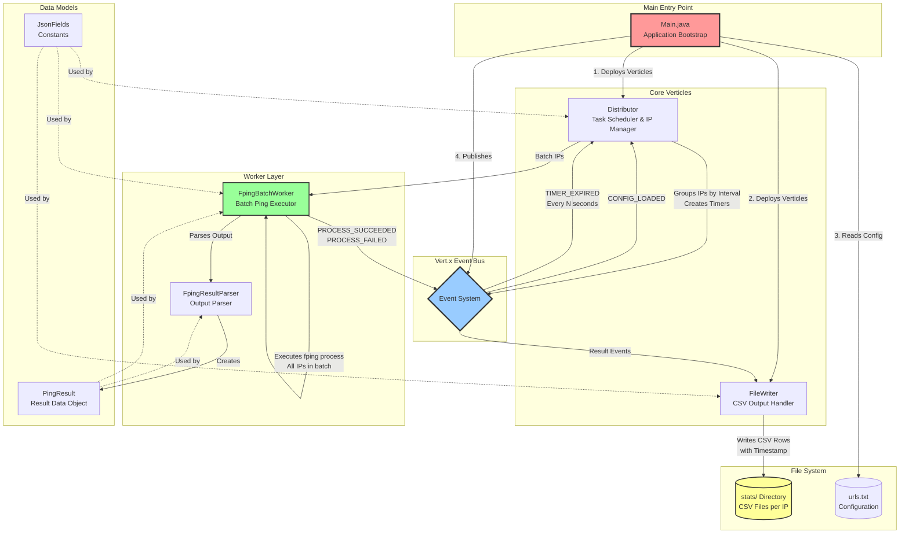
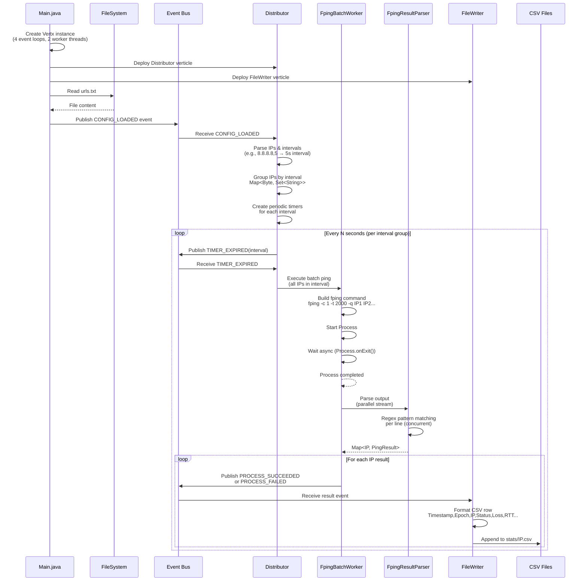
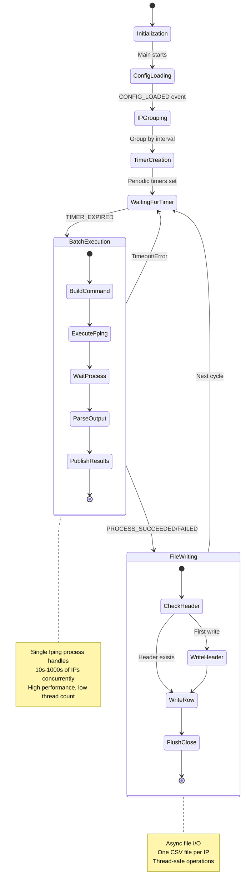
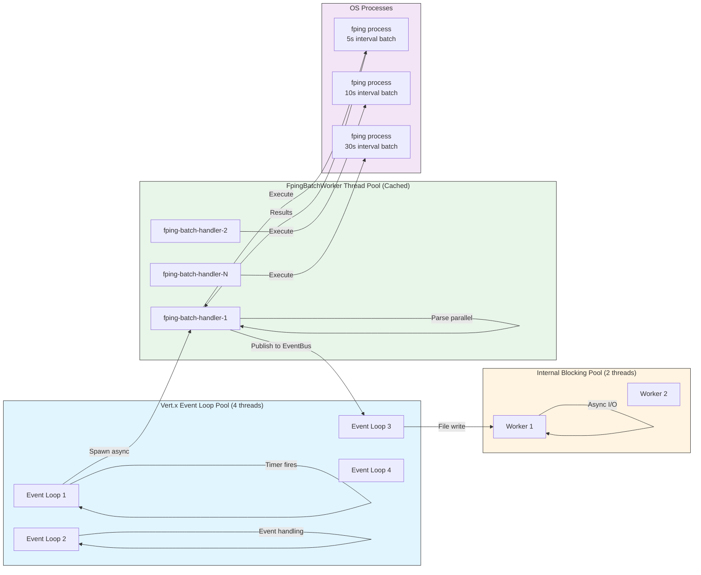
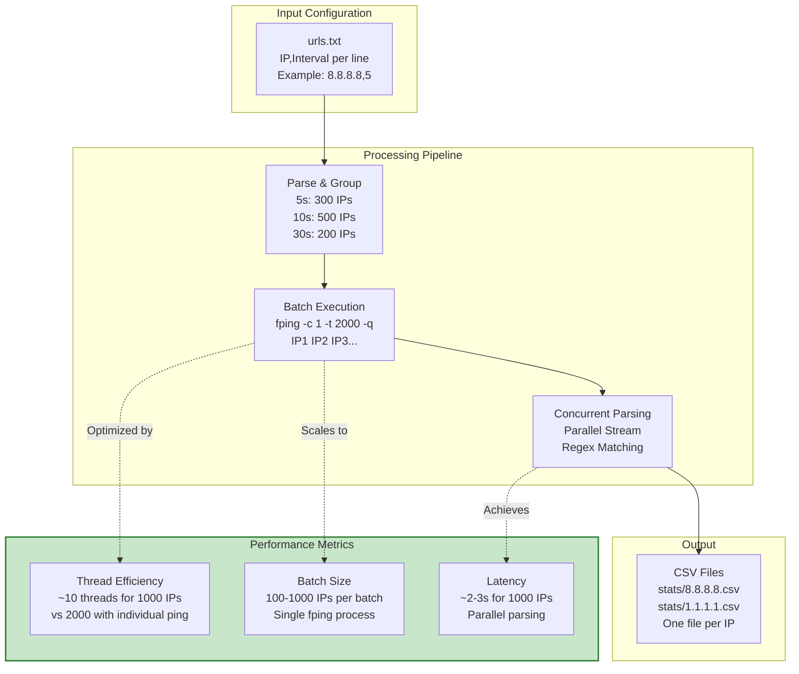
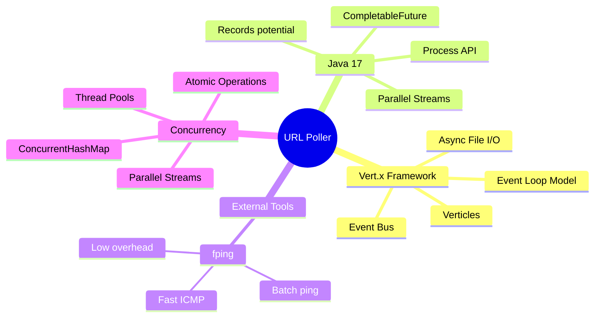

# URL Poller Architecture

## High-Level System Architecture

## Detailed Component Flow

## Event-Driven Architecture

## Thread Model & Concurrency

## Data Flow & Performance

## Key Design Patterns

### 1. **Event-Driven Architecture**
- Loose coupling via Event Bus
- 4 event types: `CONFIG_LOADED`, `TIMER_EXPIRED`, `PROCESS_SUCCEEDED`, `PROCESS_FAILED`

### 2. **Batch Processing Pattern**
- Groups IPs by interval
- Single `fping` process handles multiple IPs
- Reduces thread count from O(n) to O(intervals)

### 3. **Async/Non-Blocking**
- `Process.onExit()` for non-blocking process wait
- CompletableFuture for async composition
- Vert.x async file I/O

### 4. **Concurrent Parsing**
- Parallel streams for parsing fping output
- ConcurrentHashMap for thread-safe result collection
- Scales to 1000+ IPs per batch

### 5. **Thread-Safe Design**
- Immutable PingResult objects
- ConcurrentHashMap for shared state
- Atomic operations (ConcurrentHashMap.newKeySet)

## Technology Stack

