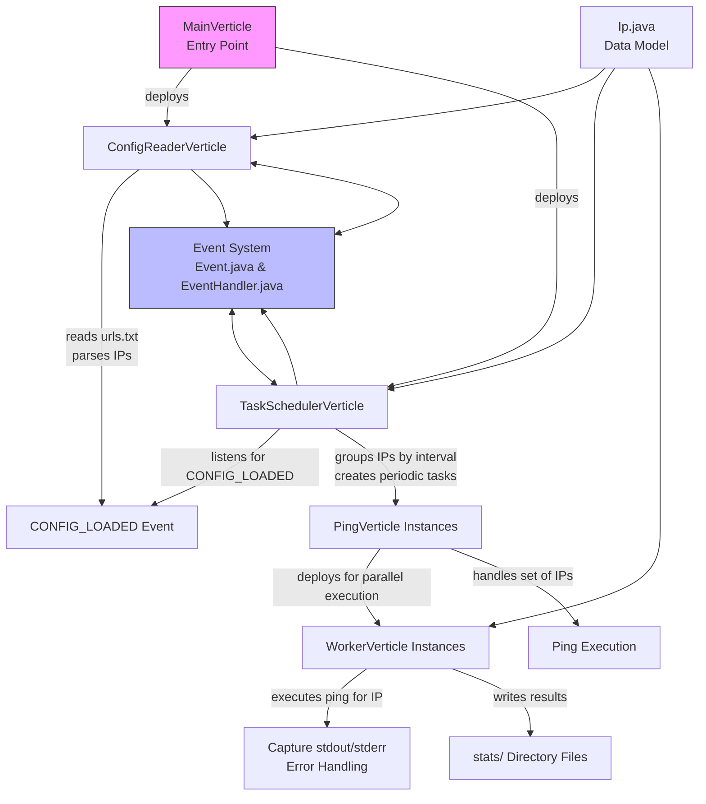

```mermaid
flowchart TD
    A[MainVerticle<br/>Entry Point] -->|deploys| B[ConfigReaderVerticle]
    A -->|deploys| C[TaskSchedulerVerticle]

    B -->|reads urls.txt<br/>parses IPs| D[CONFIG_LOADED Event]
    B --> EventSystem

    C -->|listens for CONFIG_LOADED| D
    C -->|groups IPs by interval<br/>creates periodic tasks| E[PingVerticle Instances]
    C --> EventSystem

    E -->|deploys for parallel execution| F[WorkerVerticle Instances]
    E -->|handles set of IPs| G[Ping Execution]

    F -->|executes ping for IP| H[Capture stdout/stderr<br/>Error Handling]
    F -->|writes results| I[stats/ Directory Files]

    EventSystem[Event System<br/>Event.java & EventHandler.java]
    EventSystem <--> B
    EventSystem <--> C

    IpModel[Ip.java<br/>Data Model]
    IpModel --> B
    IpModel --> C
    IpModel --> F

    style A fill:#f9f,stroke:#333
    style EventSystem fill:#bbf,stroke:#333
```
