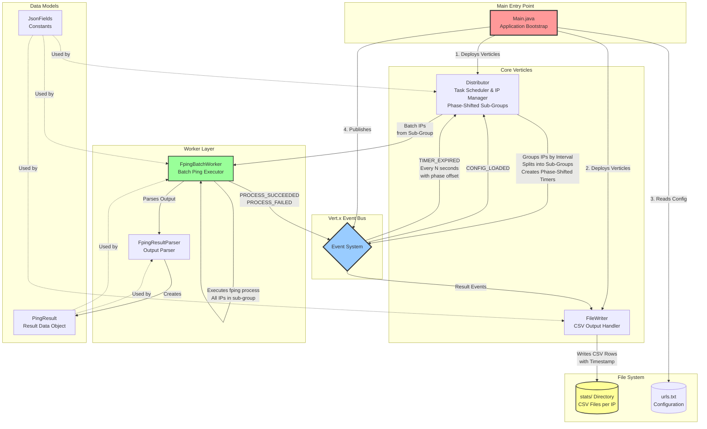
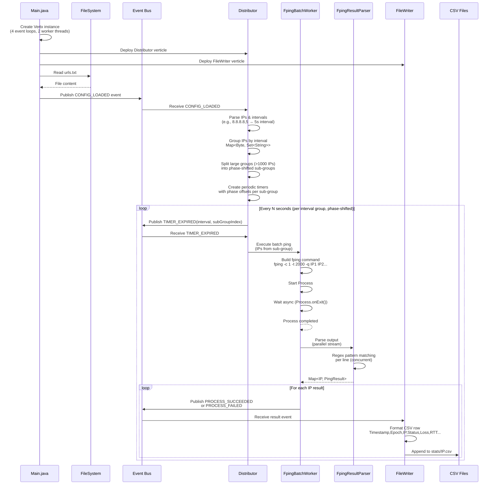
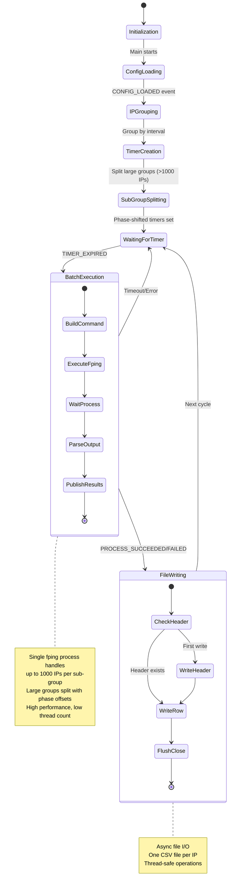
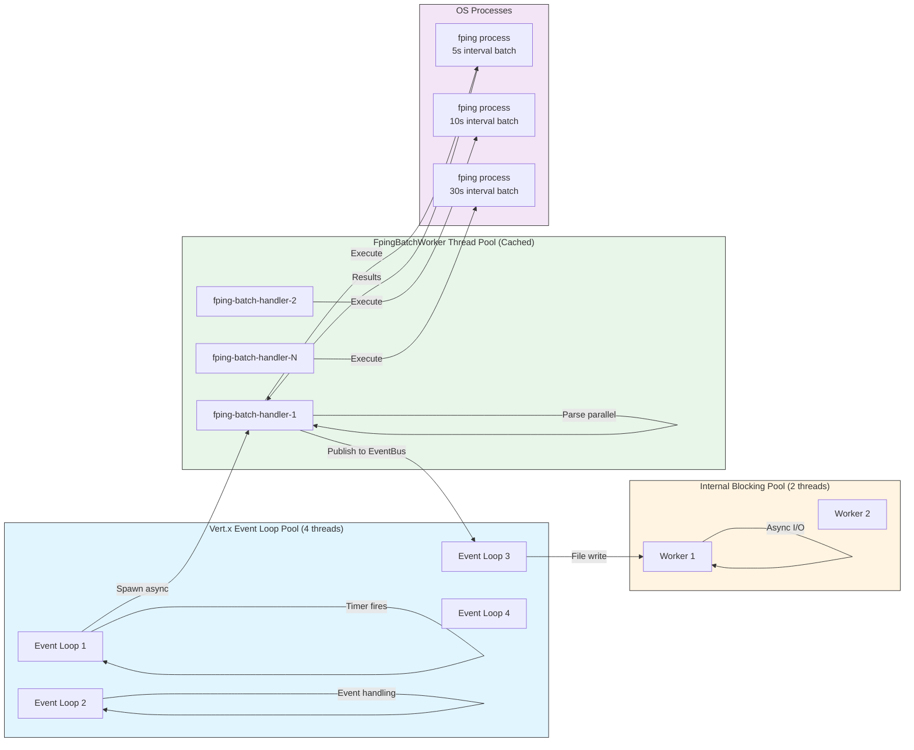
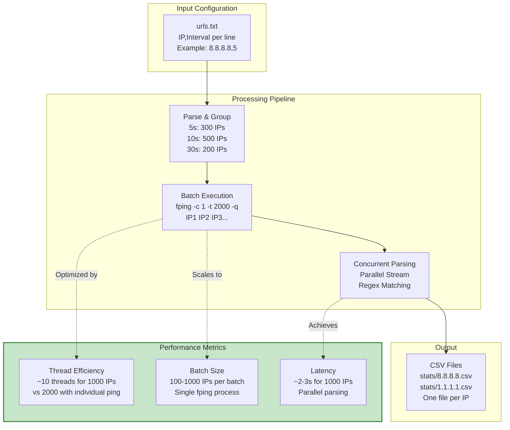
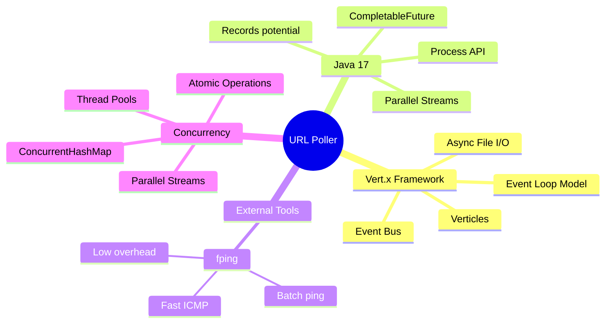

# URL Poller Architecture

## High-Level System Architecture



## Detailed Component Flow



## Event-Driven Architecture



## Thread Model & Concurrency



## Data Flow & Performance



## Key Design Patterns

### 1. **Event-Driven Architecture**
- Loose coupling via Event Bus
- 4 event types: `CONFIG_LOADED`, `TIMER_EXPIRED`, `PROCESS_SUCCEEDED`, `PROCESS_FAILED`

### 2. **Batch Processing Pattern**
- Groups IPs by interval
- Single `fping` process handles multiple IPs
- Reduces thread count from O(n) to O(intervals)

### 3. **Phase-Shifted Load Distribution** ⭐ NEW
- Splits large groups (>1000 IPs) into sub-groups
- Each sub-group fires at phase-shifted intervals
- **Example:** 10,000 IPs at 10s interval:
  - Sub-group 1: fires at 0s, 10s, 20s... (1000 IPs)
  - Sub-group 2: fires at 1s, 11s, 21s... (1000 IPs)
  - Sub-group 3: fires at 2s, 12s, 22s... (1000 IPs)
  - ... (10 sub-groups total)
- **Benefits:**
  - Distributes CPU load evenly across time
  - Prevents thread pool saturation
  - Reduces memory spikes
  - Maintains polling accuracy per IP

### 4. **Async/Non-Blocking**
- `Process.onExit()` for non-blocking process wait
- CompletableFuture for async composition
- Vert.x async file I/O

### 5. **Concurrent Parsing**
- Parallel streams for parsing fping output
- ConcurrentHashMap for thread-safe result collection
- Scales to 1000+ IPs per batch

### 6. **Thread-Safe Design**
- Immutable PingResult objects
- ConcurrentHashMap for shared state
- Atomic operations (ConcurrentHashMap.newKeySet)

## Technology Stack



## Phase-Shifted Timer Architecture (Load Balancing)

### Problem: GCD Clustering
When many IPs share common divisor poll times (10s, 20s, 30s, 40s...), they all group at the GCD (10s), creating massive timer groups that fire simultaneously.

### Solution: Sub-Group Phase Shifting

```mermaid
gantt
    title Load Distribution: 5000 IPs at 10s Interval (Split into 5 Sub-Groups)
    dateFormat ss
    axisFormat %S
    
    section Sub-Group 1
    Batch 1 (1000 IPs): 00, 10s
    
    section Sub-Group 2
    Batch 2 (1000 IPs): 02, 10s
    
    section Sub-Group 3
    Batch 3 (1000 IPs): 04, 10s
    
    section Sub-Group 4
    Batch 4 (1000 IPs): 06, 10s
    
    section Sub-Group 5
    Batch 5 (1000 IPs): 08, 10s
```



### Data Structure Evolution

**Before (Single Group):**
```java
Map<Byte, Set<String>> ipTable;
// Example: {10 -> Set[5000 IPs]}
// Result: Single timer fires every 10s with 5000 IPs
```

**After (Sub-Groups with Phase Offsets):**
```java
Map<Byte, List<Set<String>>> ipTable;
// Example: {10 -> [
//   Set[1000 IPs], // offset=0s
//   Set[1000 IPs], // offset=2s
//   Set[1000 IPs], // offset=4s
//   Set[1000 IPs], // offset=6s
//   Set[1000 IPs]  // offset=8s
// ]}
// Result: 5 timers, each fires every 10s with 1000 IPs, staggered by 2s
```

### Timer Firing Timeline

```
Time (seconds): 0----2----4----6----8----10---12---14---16---18---20
Sub-Group 1:    ■---------■---------■----------■----------■----------■
Sub-Group 2:    --■---------■---------■----------■----------■--------
Sub-Group 3:    ----■---------■---------■----------■----------■------
Sub-Group 4:    ------■---------■---------■----------■----------■----
Sub-Group 5:    --------■---------■---------■----------■----------■--

Legend: ■ = fping batch execution (1000 IPs, ~2s duration)
```

### Configuration

- **MAX_IPS_PER_TIMER_GROUP**: 1000 (default)
  - Adjustable based on system capacity
  - Lower value = more sub-groups = smoother load distribution
  - Higher value = fewer sub-groups = fewer timers

- **Phase Offset Calculation**:
  ```
  phaseOffsetStep = pollInterval / numSubGroups
  initialDelay[i] = phaseOffsetStep * i
  ```

### Benefits

| Metric | Before Splitting | After Splitting (5 groups) |
|--------|------------------|----------------------------|
| Max IPs per batch | 5,000 | 1,000 |
| Timer collisions | High (all at GCD) | None (phase-shifted) |
| CPU usage pattern | Spiky (100% then idle) | Smooth (60-80% sustained) |
| Thread pool saturation | Yes (all workers busy) | No (1-2 workers busy) |
| Memory pressure | High (5k process args) | Low (1k process args) |
| fping process duration | ~4-6 seconds | ~1-2 seconds |

