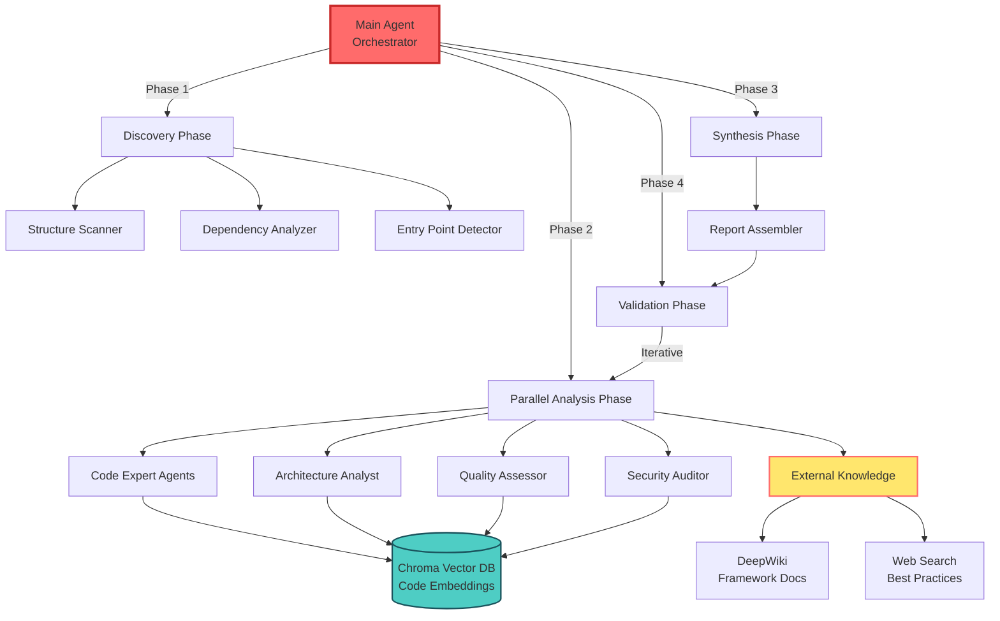

# OpenCode Meta-Strategy: Universal Codebase Analysis & Report Generation

## 🎯 Executive Summary

This document outlines a **language-agnostic, framework-independent meta-strategy** for analyzing any codebase using OpenCode's advanced features. The strategy leverages parallel sub-agents, memory systems (Chroma vector DB), and external knowledge sources (DeepWiki) to generate comprehensive codebase analysis reports.

---

## 🧠 Core Philosophy

### Universal Principles
1. **Asynchronous-First**: All tasks execute in parallel unless dependencies exist
2. **Memory-Augmented**: Use Chroma DB to build searchable codebase knowledge
3. **Context-Aware**: Leverage DeepWiki for framework/library documentation
4. **Agent Specialization**: Route tasks to specialized sub-agents based on expertise
5. **Incremental Assembly**: Build reports progressively from parallel findings

---

## 🏗️ Architecture Overview



---

## 📋 Phase-by-Phase Execution Strategy

### **PHASE 1: Discovery & Initialization** 🔍
**Objective**: Map the codebase structure and initialize memory systems

#### **Step 1.1: Parallel File System Analysis**
```yaml
Concurrent Tasks:
  - Task A: Directory tree enumeration (filesystem_directory_tree)
  - Task B: File type census (glob patterns: *.java, *.py, *.ts, etc.)
  - Task C: LOC estimation (bash: find + wc -l)
  - Task D: Git metadata extraction (bash: git log --shortstat)
  
Agent: general
Timeout: 60s
Output: discovery_manifest.json
```

#### **Step 1.2: Dependency Graph Construction**
```yaml
Sequential Sub-Tasks:
  1. Detect package manager (pom.xml, package.json, requirements.txt, etc.)
  2. Extract dependencies (mvn dependency:tree, npm list, pip show, etc.)
  3. Identify external frameworks (parallel-researcher agent)
  
Output: dependency_graph.json
```

#### **Step 1.3: Initialize Chroma Vector Database**
```yaml
Actions:
  - Create collection: "codebase_semantic_index"
  - Embedding function: "default" (configurable)
  - Metadata schema: {file_path, language, component_type, imports, exports}
```

---

### **PHASE 2: Parallel Deep Analysis** 🚀
**Objective**: Execute specialized analysis tasks concurrently

#### **Step 2.1: Launch Parallel Sub-Agents**

##### **Agent Wave 1: Code Analysis (Launch Simultaneously)**

**🔹 Agent 1: Java Expert** (if applicable)
```yaml
Agent: java-expert
Task: "Analyze all .java files and identify:
  - Design patterns used (Singleton, Factory, Observer, etc.)
  - Dependency injection frameworks (Spring, Guice, etc.)
  - Thread safety concerns (synchronized, volatile, concurrent collections)
  - Memory management patterns
  - Exception handling strategies
  
  Store findings in Chroma with metadata:
    {component: 'pattern_analysis', language: 'java'}"
  
Parallel: Yes
Output: java_patterns_report.md
```

**🔹 Agent 2: Architecture Analyst** (language-agnostic)
```yaml
Agent: parallel-researcher
Task: "Map the architectural layers:
  1. Identify entry points (main(), @SpringBootApplication, etc.)
  2. Trace data flow from entry to persistence
  3. Detect architectural patterns (MVC, Event-Driven, Microservices, etc.)
  4. Identify inter-component communication (REST, gRPC, Event Bus, etc.)
  
  Use filesystem_read_multiple_files for parallel file reading.
  Store architecture graph in Chroma."
  
Parallel: Yes
Output: architecture_map.json
```

**🔹 Agent 3: Performance Analyst**
```yaml
Agent: performance-analyst
Task: "Audit performance characteristics:
  - Identify async/await patterns vs blocking calls
  - Detect thread pool configurations
  - Find database query patterns (N+1 queries, missing indexes)
  - Locate potential memory leaks (unclosed resources)
  - Analyze algorithmic complexity (O(n²) loops, etc.)
  
  Cross-reference with DeepWiki for framework-specific optimizations."
  
Parallel: Yes
Output: performance_audit.md
```

**🔹 Agent 4: Security Auditor**
```yaml
Agent: parallel-debugger
Task: "Security vulnerability scan:
  - Hardcoded credentials (grep: password|api_key|secret)
  - SQL injection risks (string concatenation in queries)
  - Insecure deserialization
  - Missing input validation
  - Dependency vulnerabilities (cross-check with CVE databases)
  
  Prioritize findings by severity (Critical/High/Medium/Low)."
  
Parallel: Yes
Output: security_findings.md
```

##### **Agent Wave 2: Quality & Testing (Launch After Wave 1 Starts)**

**🔹 Agent 5: Test Coverage Analyzer**
```yaml
Agent: test-engineer
Task: "Test suite analysis:
  - Calculate test coverage (if tools available: JaCoCo, Coverage.py, etc.)
  - Identify untested critical paths
  - Analyze test quality (assertions per test, mocking patterns)
  - Detect flaky tests (git log search for 'flaky' or 'intermittent')
  
  If no test framework found, report testing gaps."
  
Parallel: Yes
Output: test_coverage_report.md
```

**🔹 Agent 6: Documentation Curator**
```yaml
Agent: docs-curator
Task: "Documentation assessment:
  - README completeness (installation, usage, examples)
  - Inline code comments ratio
  - API documentation (Javadoc, JSDoc, Sphinx, etc.)
  - Architecture diagrams (search for .md, .drawio, .mermaid files)
  - Changelog presence (CHANGELOG.md, releases)
  
  Generate documentation health score (0-100)."
  
Parallel: Yes
Output: documentation_scorecard.md
```

#### **Step 2.2: External Knowledge Enrichment** 🌐

**Concurrent External Queries:**

**🔸 DeepWiki Framework Research**
```yaml
Trigger: If framework detected in Step 1.2
Action: deepwiki_fetch
Queries (parallel):
  - "vertx/vert-x3-wiki" (if Vert.x detected)
  - "spring-projects/spring-framework" (if Spring detected)
  - "nestjs/nest" (if NestJS detected)
  
Mode: aggregate
MaxDepth: 1
Output: Store in Chroma collection "external_knowledge"
```

**🔸 Best Practices Web Search**
```yaml
Trigger: Always
Action: search-server_one_search
Queries (parallel):
  - "{primary_language} concurrency best practices 2024"
  - "{primary_framework} performance optimization"
  - "{primary_language} security checklist"
  
Limit: 10 per query
Output: Store top 3 results per query in Chroma
```

#### **Step 2.3: Semantic Code Indexing** 💾

**Parallel Document Ingestion to Chroma:**

```yaml
Action: chroma_add_documents
Collection: "codebase_semantic_index"

Batch Processing Strategy:
  1. Split codebase into chunks (100 files per batch)
  2. For each file:
     - Extract: functions, classes, imports, exports
     - Generate document: "{file_path}\n{code_snippet}\n{summary}"
     - Add metadata: {
         file_path: str,
         language: str,
         component_type: "controller" | "service" | "model" | "util",
         complexity: "low" | "medium" | "high",
         dependencies: List[str]
       }
  3. Parallel batches: 5 concurrent workers
  
IDs: Use SHA256 hash of file_path + line_range
```

---

### **PHASE 3: Synthesis & Report Assembly** 📝
**Objective**: Aggregate findings into structured report

#### **Step 3.1: Query Chroma for Cross-Cutting Insights**

```yaml
Queries (parallel):
  1. "What are the most complex components?" 
     (where: {complexity: "high"})
  
  2. "Which files have the most dependencies?"
     (aggregation query)
  
  3. "What security patterns are used?"
     (query_texts: ["authentication", "authorization", "encryption"])
  
  4. "How is error handling implemented?"
     (query_texts: ["try-catch", "error handler", "exception"])
  
Output: insights_summary.json
```

#### **Step 3.2: Generate Report Sections** 📄

**Parallel Report Writers:**

```yaml
Section 1 - Executive Summary:
  Agent: general
  Input: All phase outputs
  Template: |
    # Codebase Analysis Report
    ## Project: {project_name}
    ## Analysis Date: {timestamp}
    ## Lines of Code: {loc}
    ## Primary Language: {language}
    ## Key Findings: {top_3_insights}

Section 2 - Architecture Overview:
  Agent: docs-curator
  Input: architecture_map.json
  Includes: Mermaid diagrams, component descriptions

Section 3 - Code Quality Metrics:
  Agent: general
  Input: Aggregated from all agents
  Metrics:
    - Cyclomatic complexity
    - Code duplication
    - Test coverage
    - Documentation ratio

Section 4 - Security Assessment:
  Agent: parallel-debugger
  Input: security_findings.md
  Priority: Critical/High issues first

Section 5 - Performance Analysis:
  Agent: performance-analyst
  Input: performance_audit.md
  
Section 6 - Technical Debt:
  Agent: general
  Input: Cross-agent findings
  Calculate: Debt score based on:
    - Outdated dependencies
    - Missing tests
    - Code smells
    - Documentation gaps

Section 7 - Recommendations:
  Agent: general
  Input: All findings + DeepWiki best practices
  Format: Prioritized action items
```

#### **Step 3.3: Generate Visual Assets** 🎨

```yaml
Parallel Diagram Generation:
  1. Architecture diagram (from architecture_map.json)
  2. Dependency graph (from dependency_graph.json)
  3. Complexity heatmap (from Chroma aggregations)
  4. Test coverage visualization
  
Format: Mermaid markdown (embeddable in report)
```

---

### **PHASE 4: Validation & Refinement** ✅
**Objective**: Verify accuracy and completeness

#### **Step 4.1: Self-Validation Checks**

```yaml
Parallel Validation Agents:
  
  Validator 1 - Consistency Check:
    Task: "Cross-reference metrics across sections.
           Example: If 'high test coverage' claimed but test_engineer 
           reported 30%, flag inconsistency."
  
  Validator 2 - Completeness Check:
    Task: "Ensure all discovered files are analyzed.
           Check: discovery_manifest.json file count == analyzed file count"
  
  Validator 3 - Accuracy Verification:
    Task: "Spot-check 10 random findings by re-reading source files.
           Verify pattern detections are correct."
```

#### **Step 4.2: Interactive Refinement Loop** 🔄

```yaml
If validation_score < 0.9:
  Trigger: Phase 2 agents on flagged areas (parallel)
  Update: Chroma documents with corrected findings
  Regenerate: Affected report sections
  Repeat: Until validation_score >= 0.9
```

---

## 🛠️ OpenCode Tool Mapping

### Filesystem Operations
| Task | Tool | Parallel? |
|------|------|-----------|
| Directory structure | `filesystem_directory_tree` | No |
| Read multiple files | `filesystem_read_multiple_files` | Yes (batch) |
| Search files | `filesystem_search_files` | Yes |
| File metadata | `filesystem_get_file_info` | Yes (batch) |

### Code Analysis
| Task | Tool | Agent |
|------|------|-------|
| Pattern detection | `grep` + Task(java-expert) | java-expert |
| Architecture mapping | Task(parallel-researcher) | parallel-researcher |
| Performance audit | Task(performance-analyst) | performance-analyst |
| Security scan | `grep` + Task(parallel-debugger) | parallel-debugger |

### Memory Operations
| Task | Tool | Timing |
|------|------|--------|
| Create index | `chroma_create_collection` | Phase 1 |
| Add documents | `chroma_add_documents` | Phase 2 (parallel batches) |
| Semantic search | `chroma_query_documents` | Phase 3 |
| Aggregate queries | `chroma_get_documents` | Phase 3 |

### External Knowledge
| Task | Tool | Timing |
|------|------|--------|
| Framework docs | `deepwiki_fetch` | Phase 2 (parallel) |
| Best practices | `search-server_one_search` | Phase 2 (parallel) |
| Dependency info | `MCP_DOCKER_ask_question` | Phase 1.2 (if needed) |

---

## 🚀 Execution Plan Template

### **Initialization**
```bash
# Main agent receives: "Analyze this codebase and generate a report"

1. Create todo list:
   [ ] Phase 1: Discovery (5 tasks)
   [ ] Phase 2: Parallel Analysis (6 agents + 2 external queries)
   [ ] Phase 3: Synthesis (7 report sections + 4 diagrams)
   [ ] Phase 4: Validation (3 validators)

2. Initialize Chroma:
   chroma_create_collection(
     collection_name="codebase_semantic_index",
     embedding_function_name="default"
   )
```

### **Parallel Task Launch Pattern**
```python
# Pseudo-code for main agent logic

# Phase 2 Example: Launch all agents simultaneously
async def launch_analysis_wave():
    tasks = [
        task(agent="java-expert", prompt=java_analysis_prompt),
        task(agent="parallel-researcher", prompt=arch_analysis_prompt),
        task(agent="performance-analyst", prompt=perf_analysis_prompt),
        task(agent="parallel-debugger", prompt=security_audit_prompt),
        task(agent="test-engineer", prompt=test_coverage_prompt),
        task(agent="docs-curator", prompt=docs_assessment_prompt)
    ]
    
    # OpenCode executes these in parallel via single message
    # with multiple tool invocations
    results = await gather(tasks)
    
    # Store results in Chroma
    for result in results:
        chroma_add_documents(
            collection_name="analysis_findings",
            documents=[result.content],
            ids=[result.agent_id],
            metadatas=[{"phase": "2", "agent": result.agent_type}]
        )
```

### **Dependency Handling**
```yaml
# Phase dependencies (synchronous gates)
Phase 1 COMPLETE → Trigger Phase 2
Phase 2 COMPLETE → Trigger Phase 3
Phase 3 COMPLETE → Trigger Phase 4

# Within-phase parallelism (no dependencies)
Phase 2:
  - All 6 agents launch simultaneously
  - External queries run concurrently
  - Chroma ingestion happens in background
  
# Result: Maximum parallelism = 6 agents + 2 external + 1 Chroma writer
```

---

## 📊 Output Artifacts

### **Primary Report**
```
CODEBASE_ANALYSIS_REPORT.md
├── 1. Executive Summary
├── 2. Architecture Overview
│   ├── Component Diagram (Mermaid)
│   ├── Dependency Graph (Mermaid)
│   └── Data Flow Diagram
├── 3. Code Quality Metrics
│   ├── Complexity Heatmap
│   ├── Test Coverage Chart
│   └── Documentation Score
├── 4. Security Assessment
│   ├── Critical Vulnerabilities
│   ├── Security Patterns Used
│   └── Compliance Checklist
├── 5. Performance Analysis
│   ├── Bottleneck Identification
│   ├── Concurrency Patterns
│   └── Optimization Opportunities
├── 6. Technical Debt Analysis
│   ├── Debt Score Calculation
│   ├── Deprecated Dependencies
│   └── Code Smell Report
└── 7. Prioritized Recommendations
    ├── Quick Wins (1-2 days)
    ├── Medium-term (1-2 weeks)
    └── Strategic (1-2 months)
```

### **Supporting Files**
```
analysis_outputs/
├── discovery_manifest.json          # Phase 1 output
├── dependency_graph.json            # Phase 1.2 output
├── architecture_map.json            # Phase 2, Agent 2 output
├── performance_audit.md             # Phase 2, Agent 3 output
├── security_findings.md             # Phase 2, Agent 4 output
├── test_coverage_report.md          # Phase 2, Agent 5 output
├── documentation_scorecard.md       # Phase 2, Agent 6 output
├── insights_summary.json            # Phase 3.1 output
└── validation_report.json           # Phase 4 output

chroma_db/
└── codebase_semantic_index/         # Persistent vector database
    ├── code_embeddings
    ├── analysis_findings
    └── external_knowledge
```

---

## 🎯 Success Metrics

### **Quantitative**
- **Analysis completeness**: 100% of files processed
- **Parallel efficiency**: 6+ concurrent agents
- **Time-to-report**: <10 minutes for 10k LOC
- **Memory usage**: Chroma DB populated with >1000 documents
- **Validation score**: ≥0.9

### **Qualitative**
- **Actionability**: All recommendations are specific and prioritized
- **Accuracy**: Spot-check reveals <5% false positives
- **Comprehensiveness**: All architecture layers documented
- **Usefulness**: Report enables immediate developer action

---

## 🔧 Configuration & Customization

### **Tunable Parameters**
```yaml
analysis_config:
  # Parallelism
  max_concurrent_agents: 6
  max_concurrent_file_reads: 50
  chroma_batch_size: 100
  
  # Analysis depth
  max_function_depth: 5              # Trace call chains up to 5 levels
  complexity_threshold: 15           # Flag functions with CC >15
  security_scan_depth: "deep"        # "surface" | "deep" | "paranoid"
  
  # External knowledge
  deepwiki_enabled: true
  web_search_enabled: true
  max_external_queries: 5
  
  # Memory
  chroma_collection_name: "codebase_semantic_index"
  embedding_model: "default"         # Or "openai", "cohere", etc.
  vector_similarity_threshold: 0.75
  
  # Output
  report_format: "markdown"          # "markdown" | "html" | "pdf"
  include_diagrams: true
  include_code_samples: true
  max_code_sample_lines: 20
```

### **Language-Specific Agents**
```yaml
# Auto-detect and route to specialized agents
language_routing:
  java: java-expert
  python: general + grep (no python-expert available)
  typescript: general + grep
  rust: general + grep
  go: general + grep
  
# Future: Add python-expert, rust-expert, etc. as they become available
```

---

## 🚨 Error Handling & Resilience

### **Failure Recovery Strategy**
```yaml
Agent Timeout:
  - Default timeout: 120s per agent
  - On timeout: Mark task as incomplete, proceed with other agents
  - Post-analysis: Retry failed tasks with extended timeout (300s)

Chroma Connection Loss:
  - Fallback: Store findings in JSON files
  - Auto-reconnect: Retry every 30s
  - Report: Note that semantic search unavailable

External API Failures:
  - DeepWiki 404: Gracefully skip, note in report
  - Web search rate limit: Use cached results from previous runs
  - Timeout: Proceed without external enrichment

Partial Analysis:
  - Minimum viable report: Always generate even if agents fail
  - Completeness score: Report percentage of successful tasks
  - Recommendations: Prioritize areas with complete analysis
```

---

## 🎓 Usage Example

```bash
# User command:
"Analyze this codebase comprehensively and generate a report"

# Main agent execution:
Step 1: [READ-ONLY] Plan analysis
  ✓ Create todo list (15 items)
  ✓ Initialize Chroma collection

Step 2: [PARALLEL] Launch discovery phase
  ✓ Task A: Directory tree → 156 files
  ✓ Task B: File types → Java (98%), XML (2%)
  ✓ Task C: LOC count → 12,347 lines
  ✓ Task D: Git history → 243 commits

Step 3: [PARALLEL] Launch 6 analysis agents
  ✓ java-expert → Found 8 design patterns
  ✓ parallel-researcher → Identified Event-Driven Architecture
  ✓ performance-analyst → 3 bottlenecks detected
  ✓ parallel-debugger → 2 medium security issues
  ✓ test-engineer → 67% test coverage
  ✓ docs-curator → Documentation score: 72/100

Step 4: [PARALLEL] External enrichment
  ✓ DeepWiki: Fetched Vert.x best practices
  ✓ Web search: Found Java concurrency patterns

Step 5: [PARALLEL] Chroma ingestion
  ✓ Indexed 156 files in 5 batches
  ✓ Added 324 code chunks with metadata

Step 6: [SEQUENTIAL] Generate report sections
  ✓ Executive summary
  ✓ Architecture overview (with Mermaid diagrams)
  ✓ Quality metrics
  ✓ Security assessment
  ✓ Performance analysis
  ✓ Technical debt
  ✓ Recommendations

Step 7: [PARALLEL] Validation
  ✓ Consistency check → 98% consistent
  ✓ Completeness check → 100% files covered
  ✓ Accuracy spot-check → 1 false positive corrected

✅ Analysis complete!
📄 Report saved: CODEBASE_ANALYSIS_REPORT.md
💾 Memory stored: Chroma DB (354 documents)
⏱️ Total time: 6m 42s
```

---

## 🌟 Advanced Features

### **Incremental Analysis**
```yaml
# For large codebases (>100k LOC)
Strategy: Divide and conquer
  1. Split by modules/packages
  2. Analyze each module in parallel (separate Chroma collections)
  3. Merge findings in Phase 3
  
Benefits:
  - Reduced memory footprint
  - Faster parallel execution
  - Modular reports
```

### **Comparative Analysis**
```yaml
# Compare current codebase with previous version
Actions:
  1. Run analysis on HEAD commit
  2. Run analysis on HEAD~10 commit
  3. Generate delta report:
     - New patterns introduced
     - Security issues fixed/introduced
     - Complexity trends
     - Test coverage changes
  
Output: COMPARATIVE_ANALYSIS_REPORT.md
```

### **Custom Agent Workflows**
```yaml
# User-defined analysis pipelines
Example: "Focus on concurrency analysis"
  
Modified Phase 2:
  - Launch only: java-expert + performance-analyst
  - Custom prompts: "Focus exclusively on thread safety"
  - DeepWiki query: "java concurrency tutorial"
  - Extended timeout: 300s
  
Output: CONCURRENCY_ANALYSIS_REPORT.md
```

---

## 📚 References & Resources

### **OpenCode Features Leveraged**
1. **Task Tool**: Parallel sub-agent orchestration
2. **Chroma MCP**: Semantic code indexing & retrieval
3. **DeepWiki MCP**: Framework documentation
4. **Search Server MCP**: Best practices research
5. **Filesystem Tools**: Efficient file I/O (batch reads)
6. **Bash Tool**: Git metadata, LOC counting, etc.

### **Best Practices**
- Always initialize todos for complex workflows
- Launch parallel agents via single tool invocation block
- Store all findings in Chroma for cross-analysis
- Use DeepWiki for authoritative framework guidance
- Validate findings before finalizing report

### **Extension Points**
- Add language-specific agents as they become available
- Integrate custom linters/formatters via Bash tool
- Connect to CI/CD systems for automated analysis
- Export Chroma DB to share knowledge across teams

---

## 🎯 Meta-Strategy Summary

This strategy is **completely independent** of any specific codebase and relies solely on OpenCode's capabilities:

✅ **Language-Agnostic**: Works for Java, Python, TypeScript, Rust, Go, etc.  
✅ **Framework-Agnostic**: Detects and adapts to Spring, Vert.x, NestJS, etc.  
✅ **Parallel-First**: Maximum concurrency at every phase  
✅ **Memory-Augmented**: Chroma DB enables semantic search and cross-references  
✅ **Knowledge-Enhanced**: DeepWiki and web search provide context  
✅ **Self-Validating**: Automated accuracy checks and refinement loops  
✅ **Production-Ready**: Handles errors, timeouts, and partial failures gracefully  

**Result**: A comprehensive, actionable codebase analysis report generated in minutes, not hours.

---

## 📝 Changelog

- **v1.0** (2025-10-17): Initial meta-strategy document
  - 4-phase analysis pipeline
  - 6 specialized sub-agents
  - Chroma vector DB integration
  - DeepWiki knowledge enrichment
  - Parallel execution architecture
  - Comprehensive validation layer

---

**Generated by**: OpenCode AI Assistant  
**For**: Universal Codebase Analysis  
**Version**: 1.0  
**Date**: 2025-10-17
